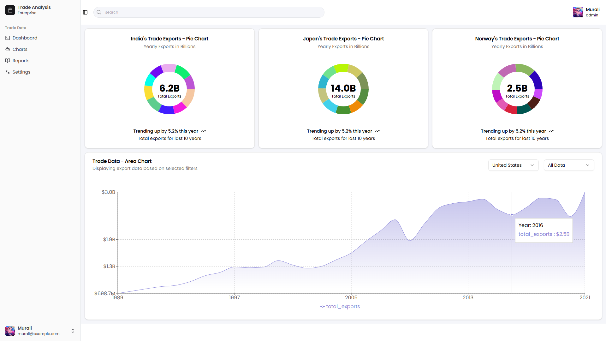

This is a [Next.js-15](https://nextjs.org) project bootstrapped with [`create-next-app`](https://nextjs.org/docs/app/api-reference/cli/create-next-app).



## Getting Started

Install and run the project:

```bash
npm install --force

npm run dev
# or
yarn dev
# or
pnpm dev
# or
bun dev
```

Deployed site: [https://next15-kaggle-data-visualization.vercel.app](https://next15-kaggle-data-visualization.vercel.app/home)

Open [http://localhost:3000](http://localhost:3000) for local development.


## Resouces used in the project

Resources used in the project:

- Next.Js
- TypeScript for type safety
- Tailwind
- Authentication - Auth0
- Analytics - Kaggle-International-trade-analysis(https://www.kaggle.com/datasets/dollytheanalyst/international-trade-analysis)
- Reacharts.js and Shadcn charts

## Deployed on Vercel

- React Query and Axios was not required as the JSON data was stored in the server.
- Avoided React Query and Axios to minimize dependency.
- Applied Caching techniques like 
  - memoization  
  - lazy-loading
  - code-splitting